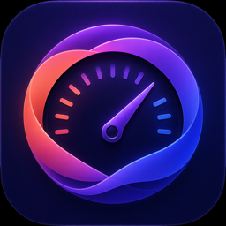

# VibeMeter

VibeMeter is a native macOS menu-bar app that shows remaining Claude and Codex subscription usage in one place.



## Features

- Claude five-hour, weekly, model-specific, and active dynamic usage limits
- Codex rate-limit windows through the local Codex app server
- Configurable menu-bar display: lowest limit, both providers, or icon only
- Automatic refresh every five minutes, after wake, and when connectivity returns
- Saved snapshots with an obvious stale-data state when a provider is temporarily unavailable
- Optional per-window low-usage alerts and launch at login
- Partial operation when only one provider is installed or authenticated

## Requirements

- macOS 15 or newer
- Claude Code signed in with a Claude subscription for Claude usage
- Codex CLI signed in with ChatGPT for Codex usage

The integration has been verified with Claude Code 2.1.207 and Codex CLI 0.144.3. VibeMeter checks capabilities at runtime, so version numbers are guidance rather than hard gates.

## Local development

```sh
xcodegen generate
```

This regenerates `VibeMeter.xcodeproj` from `project.yml` after files or build settings change.

```sh
xcodebuild -project VibeMeter.xcodeproj -scheme VibeMeter -derivedDataPath DerivedData CODE_SIGNING_ALLOWED=NO build
```

This compiles an unsigned local debug build without requiring an Apple developer certificate.

```sh
xcodebuild -project VibeMeter.xcodeproj -scheme VibeMeter -derivedDataPath DerivedData CODE_SIGNING_ALLOWED=NO test
```

This runs the unit and sanitized provider-response tests.

```sh
open DerivedData/Build/Products/Debug/VibeMeter.app
```

This launches the locally built menu-bar app.

```sh
./scripts/test-live.sh
```

This opts into read-only integration tests against the Claude and Codex accounts already signed in on the Mac.

## Homebrew installation

After the first release is published:

```sh
brew tap ivansandev/vibemeter
```

This adds the `ivansandev/homebrew-vibemeter` repository as a custom Homebrew tap.

```sh
brew install --cask vibemeter
```

This downloads the notarized VibeMeter app and installs it in `/Applications`.

## Privacy and security

VibeMeter has no analytics or telemetry.

- Claude: VibeMeter asks macOS Keychain for Claude Code's existing credential and uses it only in memory for a read-only usage request. The token is never logged or written by VibeMeter. Claude's usage endpoint is internal and isolated in `ClaudeUsageProvider` so compatibility changes remain contained.
- Codex: VibeMeter launches `codex app-server --stdio` and requests `account/rateLimits/read`. It does not open or copy `~/.codex/auth.json`.
- Cache: only usage percentages, reset dates, plan labels, timestamps, and preferences are stored locally.

The first Claude refresh may produce a macOS Keychain access prompt. Rejecting it leaves Codex working and shows Claude as unavailable.

## Troubleshooting

- If Claude is unavailable, run `claude`, confirm you are signed in with the subscription account, and refresh VibeMeter.
- If Codex is unavailable, run `codex login`, then set the executable path in VibeMeter Settings if the CLI is installed in a nonstandard location.
- If saved values are marked stale, use Refresh; VibeMeter keeps the previous snapshot while explaining that the latest request failed.

## Releases

The `Release VibeMeter` GitHub Actions workflow is manually triggered with a semantic version. It imports the Developer ID certificate, builds a universal binary, signs and notarizes the app, publishes the ZIP, and updates the Cask checksum directly on the default branch. It does not create a release branch or pull request.

Required repository secrets:

- `DEVELOPER_ID_APPLICATION_P12_BASE64`
- `DEVELOPER_ID_APPLICATION_PASSWORD`
- `DEVELOPER_ID_APPLICATION_NAME`
- `APPLE_ID`
- `APPLE_TEAM_ID`
- `APPLE_APP_SPECIFIC_PASSWORD`

## License

VibeMeter is available under the [MIT License](LICENSE).
